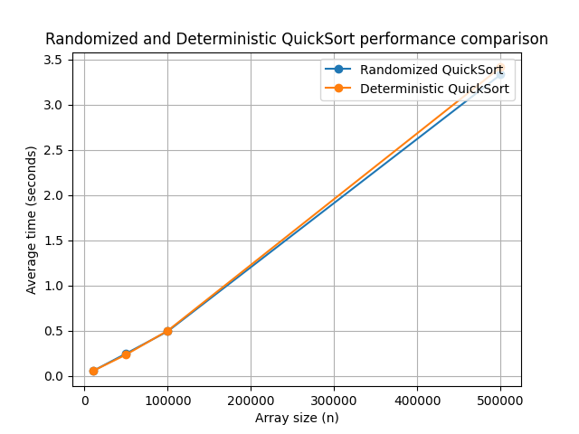

# Algorithmic complexity, approximate and randomized algorithms
## Task 1. Comparison of Randomized and Deterministic QuickSort

Implement the randomized and deterministic QuickSort sorting algorithms. Conduct a comparative analysis of their efficiency by measuring the average execution time on arrays of different sizes.

### Specifications

1. To implement the randomized QuickSort algorithm, implement the function randomized_quick_sort(arr), where the pivot element (pivot) is chosen randomly.

2. To implement the deterministic QuickSort algorithm, implement the function deterministic_quick_sort(arr), where the pivot element is chosen according to a fixed rule: the first, last, or middle element.

3. Create a set of test arrays of different sizes: `10_000`, `50_000`, `100_000`, and `500_000` elements. Fill the arrays with random integers.

4. Measure the execution time of both algorithms on each array. For a more accurate estimate, repeat the sorting of each array 5 times and calculate the average execution time.

### Prerequisites 
```bash
poetry install
poetry shell
```

### To run
```bash
poetry run .\app\task1.py
```

### Result

```bash
Number of elements: 10000
         Randomized quick sort: 0.051811 sec
         Deterministic quick sort: 0.051901 sec

Number of elements: 50000
         Randomized quick sort: 0.245557 sec
         Deterministic quick sort: 0.233997 sec

Number of elements: 100000
         Randomized quick sort: 0.491610 sec
         Deterministic quick sort: 0.498344 sec

Number of elements: 500000
         Randomized quick sort: 3.332493 sec
         Deterministic quick sort: 3.412794 sec
```

### Conclusion
The graph compares the performance of Randomized QuickSort and Deterministic QuickSort depending on the size of the array.

Both algorithms demonstrate almost identical performance, as can be seen from the closeness of the lines.
Randomized QuickSort is slightly faster at all array sizes, especially for large values ​​of n.
The execution time grows linearly (almost 𝑂(𝑛log(𝑛))), which is expected for QuickSort in the average case.
#### Key points:
Randomized QuickSort avoids the worst case (when the support element is chosen poorly) due to random selection.
Deterministic QuickSort (the classic implementation) can perform similarly well if the data is already well shuffled.
So, although the difference is small, Randomized QuickSort is usually slightly more efficient due to the lower probability of falling into the worst case 𝑂(𝑛^2).